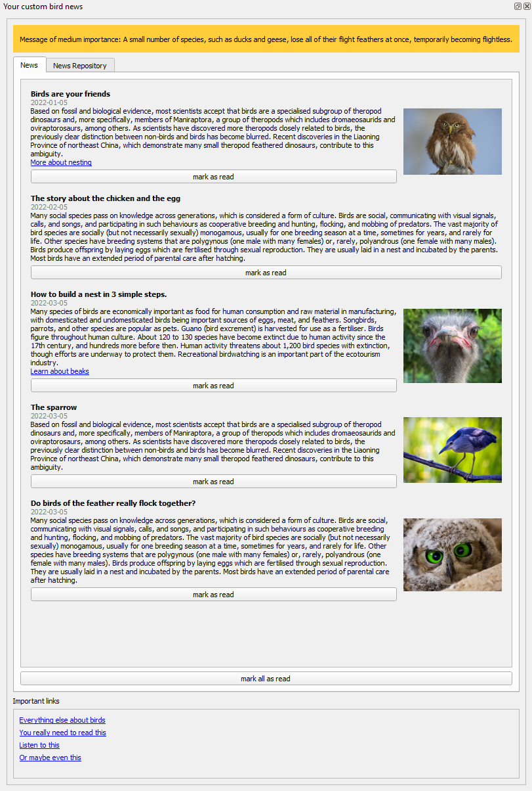

# Custom News Feed

## What do I use Custom News Feed for?
Custom News Feed is a [QGIS](https://www.qgis.org/en/site/) plugin that lets you display a feed of articles containing a title, date, text, image and link. The information to display is managed in a JSON-file.
Custom News Feed plugin is helpful if you want to distriubte news articles organisation-wide.

## Where can I get it?
Install [Custom News Feed](https://plugins.qgis.org/plugins) directly in QGIS by using the [Plugins menu](http://docs.qgis.org/latest/en/docs/user_manual/plugins/plugins.html).

## License
The Custom News Feed plugin is licensed under the [GPL-3.0 license](LICENSE).
Copyright © 2022 [GeoWerkstatt GmbH](https://www.geowerkstatt.ch)

## Konfiguration file
The JSON-file used to display your custom news has the following properties.

    "PanelTitle" : string (mandatory),

#### Articles which will be displayed in the main section of the plugin window
    "NewsArticles": array of objects [
            {
                "Title":string (mandatory),
                "Date": string (mandatody),
                "Text":string (mandatory),
                "LinkUrl":string (optional),
                "LinkTitle": string (optional),
                "ImageUrl": url (optional),
            },
            {
                ...
            }
        ],

#### Links which will be displayed below the main section of the plugin window
        "LinkSectionTitle" : string (mandatory),
        "Links": [
            {
                "Url":url (optional)
                "LinkTitle": string (optional)
            },
        ],

#### Message which will be displayed at the top of the news articles in green (low importance), yellow (medium importance) or red (high importance)
        "PinnedMessage": {
            "Text": string (optional),
            "Importance": 'high', 'medium' or 'low' (optional)
        }

        "PathToConfigurationFileLabel": string (optional)
    }

